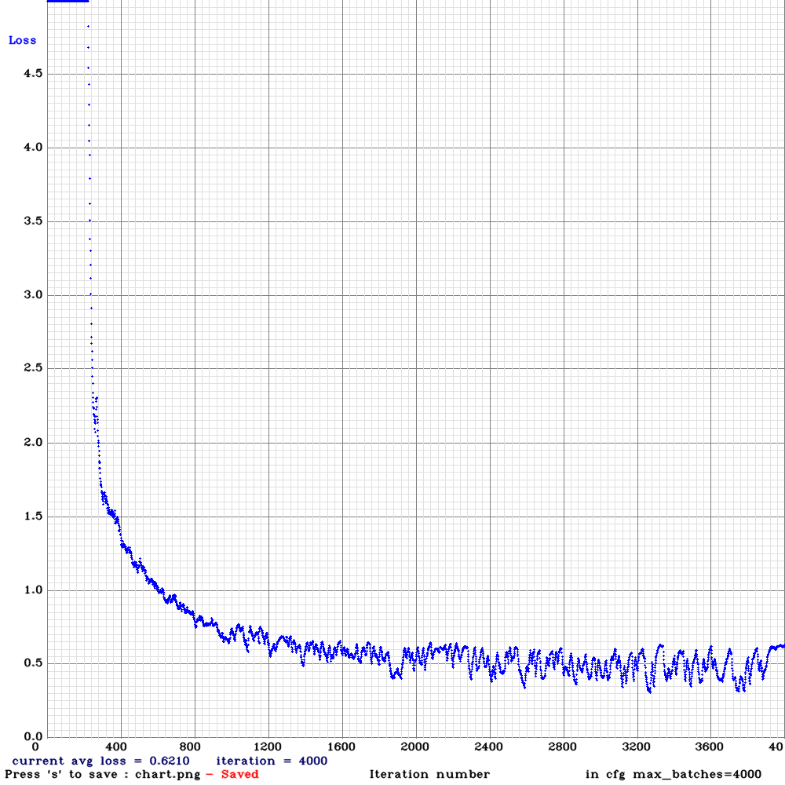
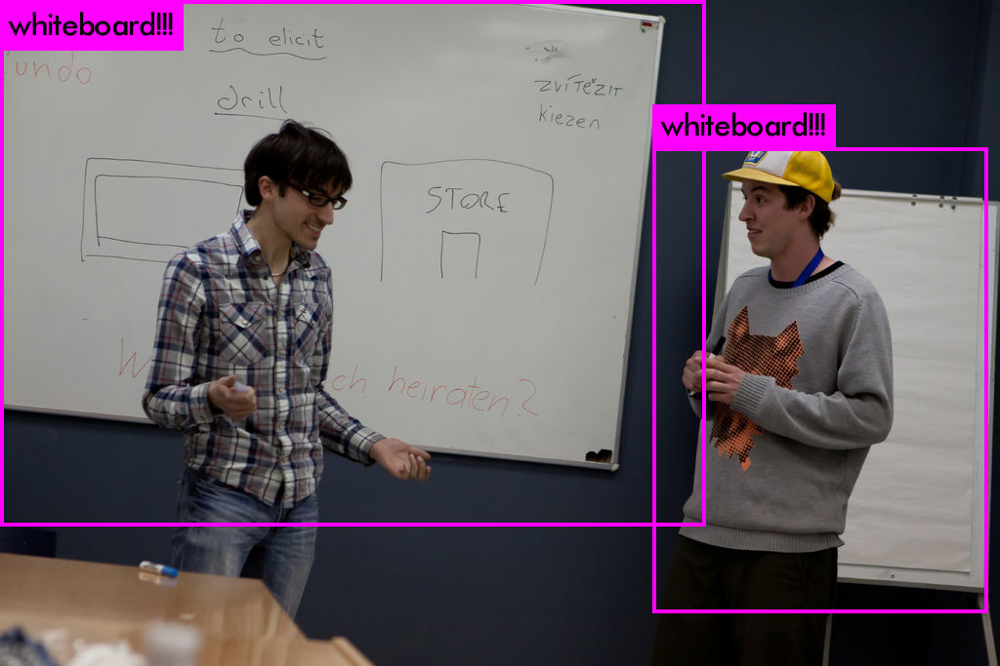

# Install and test

For initial installation of darknet, first go to the folder where you want to
install the project into. Then, clone repository by running:

```bash
git clone https://github.com/AlexeyAB/darknet
```

Next, follow the [cmake installation instructions for linux](https://github.com/AlexeyAB/darknet#how-to-compile-on-linux-using-cmake).
Then, get the default yolo weights to test:
1. In the darknet github README under the "Pre-trained models" section, click on the "CLICK ME" next to "Yolo v3 models"
2. Click on "yolov3.weights" link, this download will take a while
3. Move it to the darknet folder from downloads. (e.g. Downloads/yolov3.weights -> darknet/yolov3.weights)

Finally, test by running: 
```bash
./darknet detector test ./cfg/coco.data ./cfg/yolov3.cfg ./yolov3.weights.
```
*Note, if you are using a CPU the darknet execution will be slow, so be patient.* For more involved
examples run one of the [examples](https://github.com/AlexeyAB/darknet#how-to-use-on-the-command-line).


# Custom whiteboard detection
*Note, these instructions were written on 15/03/2020.
Some links used are might change or be broken at a later date.*

## Getting whiteboard data
First, download bounding box annotations file by:
1. Going to [https://storage.googleapis.com/openimages/web/download.html](https://storage.googleapis.com/openimages/web/download.html)
2. Clicking "Train" in the "Boxes" row, this download will take a while.
3. Moving ```oidv6-train-annotations-bbox.csv``` into ```darknet/data/```.

Then, correctly place our custom whiteboard dataset downloading python script by copying
```get_whiteboard_dataset.py``` from this repository into ```darknet/scripts/```.

The download script uses awscli which can be downloaded by running:
```bash
cd ~/Downloads
curl "https://awscli.amazonaws.com/awscli-exe-linux-x86_64.zip" -o "awscliv2.zip"
unzip awscliv2.zip
sudo ./aws/install
```

Next, create a folder for the whiteboard data to be downloaded into by going to the darknet folder
and calling:
```bash
mkdir data/whiteboard
```

Then, to get the dataset, go to root of darknet folder and run:
```python
python3 ./scripts/get_whiteboard_dataset.py
```
This will take quite a long time.

## Training
First, correctly place our custom configuration files by copying
```yolov3-tiny_whiteboard.cfg```, ```whiteboard.names```, ```whiteboard.data```
to ```darknet/cfg```, and move ```train.txt``` to ```darknet/data```

Then, download the [yolov3-tiny weights](https://pjreddie.com/media/files/yolov3-tiny.weights), move
```yolov3-tiny.weights``` to the darknet folder, and get the pre-trained weights by calling
```./darknet partial cfg/yolov3-tiny.cfg yolov3-tiny.weights yolov3-tiny.conv.15 15```

Finally, start the training by calling:
```bash
./darknet detector train cfg/whiteboard.data cfg/yolov3-tiny_whiteboard.cfg yolov3-tiny.conv.15
```
Watch the total loss, when it looks like it has converged, stop the training. Knowing when to stop, is a bit of an art, but for the whiteboard dataset, so far 0.5 has been a typical total loss to converge to.
For example, see the following learning curve:



## Testing

### Single image
First, copy ```yolov3-tiny_whiteboard.weights``` to the darknet folder. Then call:
```bash
./darknet detector test ./cfg/whiteboard.data ./cfg/yolov3-tiny_whiteboard.cfg ./yolov3-tiny_whiteboard.weights
```
and choose an example image to test on (e.g. ```data/whiteboard/02eb3145e144ea41.jpg```).
The result should look something like this:



### Video Test
To run the network on a video, call:
```bash
./darknet detector demo ./cfg/whiteboard.data ./cfg/yolov3-tiny_whiteboard.cfg yolov3-tiny_whiteboard.weights <video-path> -out_filename res.avi
```
